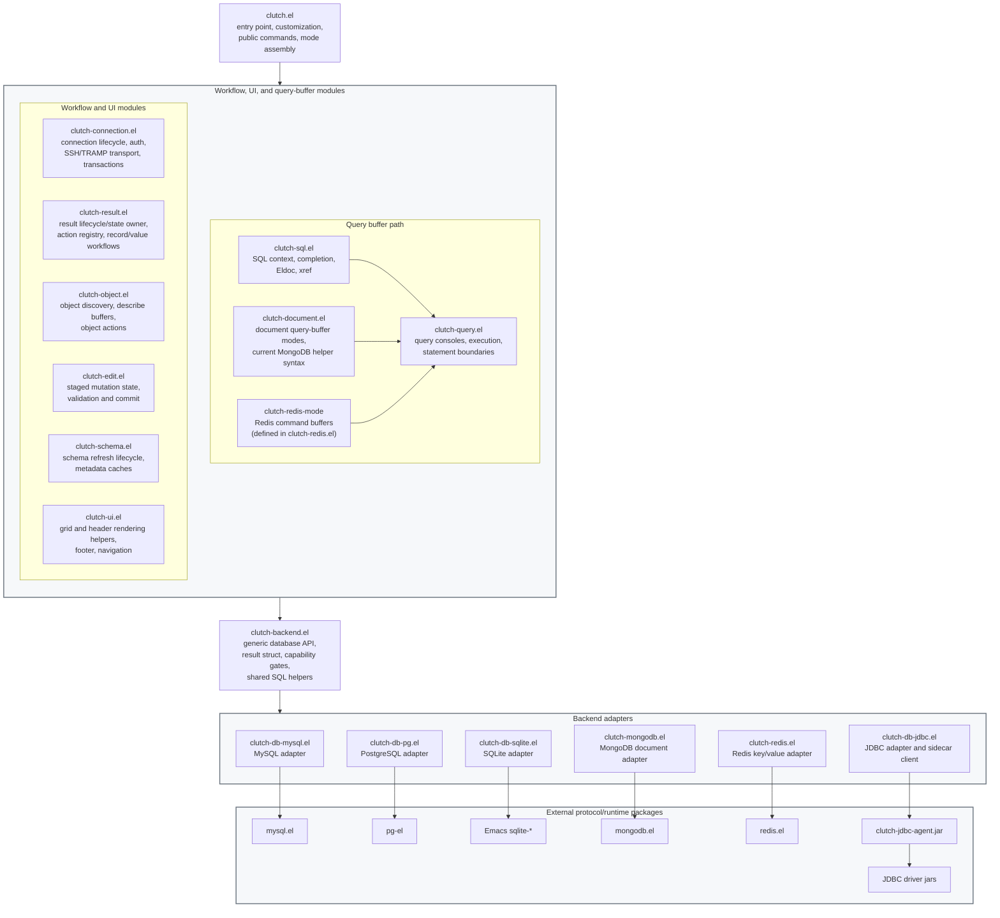
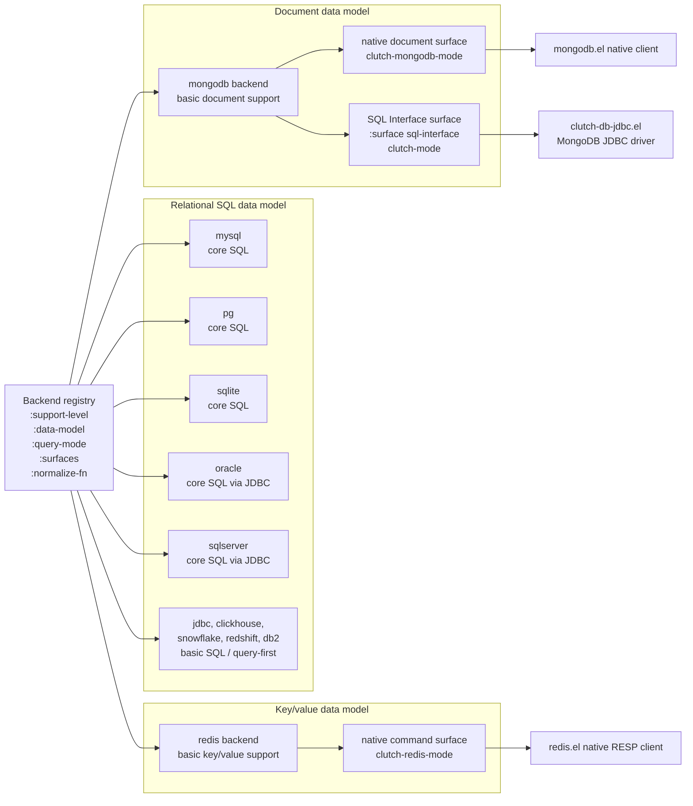
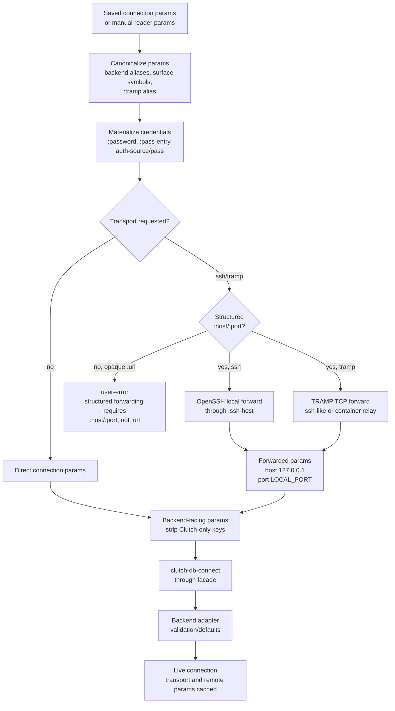
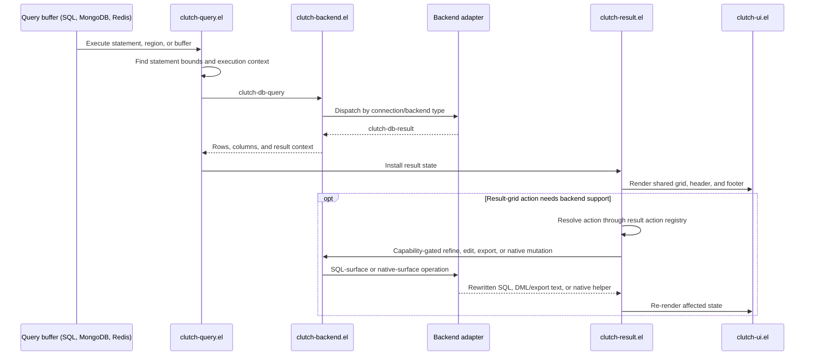
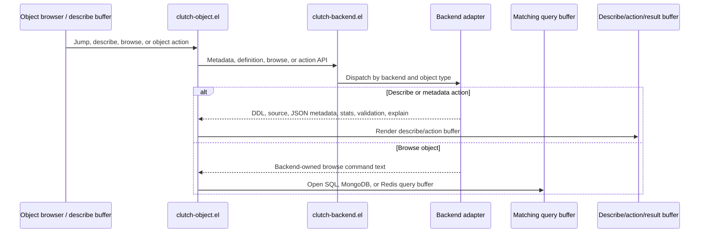
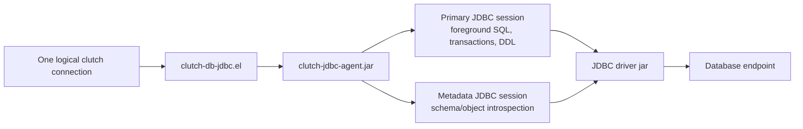

# clutch Architecture

This document is the current architecture review map for `clutch`. It describes
the module boundaries that should hold after the relational SQL, document
database, and JDBC surface refactor. Historical rationale lives in
[`postmortem/`](../postmortem/); this file should describe the current design.

## Layered Module Architecture

This diagram shows primary runtime/workflow ownership, not every `require` form.
Arrows between the large groups show layer boundaries. Adapter-to-runtime
arrows are expanded only at the bottom layer, where they identify the external
protocol package or runtime each adapter delegates to.
The facade is the database contract boundary. Workflow modules call generic
`clutch-db-*` operations instead of protocol packages. Backend adapters own
database-specific connection params, metadata, object definitions, query
execution, and type mapping.

`clutch-query.el` is query-console workflow, not the SQL layer. SQL-specific
analysis and completion live in `clutch-sql.el` and are installed by
`clutch-mode`, whose major-mode definition remains in `clutch.el`. Document
query-buffer behavior is selected through backend registry metadata.
`clutch-document.el` currently provides `clutch-mongodb-mode` for MongoDB and
reuses the shared query workflow for execution. Future document backends should
register their own query mode instead of adding MongoDB branches to generic
workflow modules. Redis registers `clutch-redis-mode` from its adapter because
the mode is Redis-specific and small; protocol work still lives in `redis.el`.
`clutch-result.el` owns result buffer lifecycle state, paging/filter/sort state,
refine state, and the result action registry. `clutch-edit.el` owns staged
mutation payloads. `clutch-ui.el` is a shared rendering/helper module for
result grids and connection header-line presentation; it is not a separate
workflow entry point or result-state owner, so its same-layer helper edges are
omitted from this overview.

## Backend And Surface Model

`mongodb` is one backend. Ordinary MongoDB uses the native document surface.
MongoDB SQL Interface is a `:surface sql-interface` path on the same backend.
It is not a second public backend, driver, feature, or manual chooser entry.
`redis` is a separate key/value backend with a native command surface. It is
not a document backend and should not reuse MongoDB collection/document actions.
SQL-only result and staged-mutation actions are gated by the registered
relational data model or by an explicit SQL Interface surface; native document
and key/value surfaces keep only backend-neutral grid actions unless their
adapter exposes a dedicated capability.
DuckDB currently has a JDBC driver source and URL/runtime helpers, but no
registered backend symbol; use it through the generic `jdbc` path.

## Connection Flow

Transport is below the backend data model. SSH and TRAMP rewrite only
structured TCP endpoints. Opaque JDBC URLs and MongoDB `mongodb://` /
`mongodb+srv://` URLs are not parsed or rewritten by Clutch.
Adapter-owned validation and defaults include backend-specific checks such as
removed timeout option rejection, SSL/TLS normalization, and JDBC timeout
defaults.

## Query And Object Flow

The result grid is shared across SQL, document, and key/value query results.
Query buffers differ by language helper and statement-boundary rules, but query
execution always converges in `clutch-query.el` before calling the generic
backend API. Object browsing is intentionally separate: `clutch-object.el` asks
the adapter for metadata, definitions, native actions, or browse command text.
Browse command text is opened in the matching query-buffer mode instead of
pretending that every backend has SQL tables. Result-buffer actions use a single
action registry owned by `clutch-result.el`, so SQL rewrite/edit/export stays on
SQL surfaces while native document/key/value surfaces expose only
adapter-supported operations.

## JDBC Runtime Shape

JDBC uses a JVM sidecar because those databases are exposed through JDBC
drivers, not through pure Elisp protocol packages. The sidecar keeps foreground
queries separate from metadata refresh where the driver/database benefits from
separate sessions.
