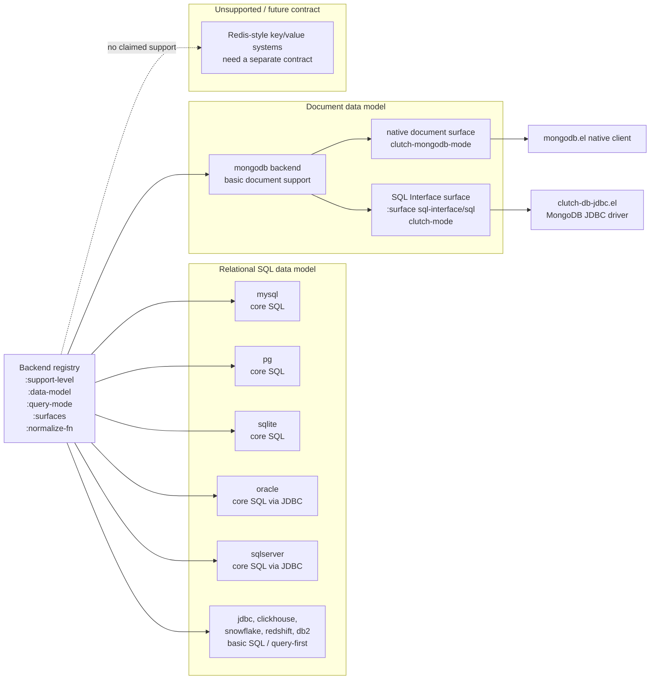
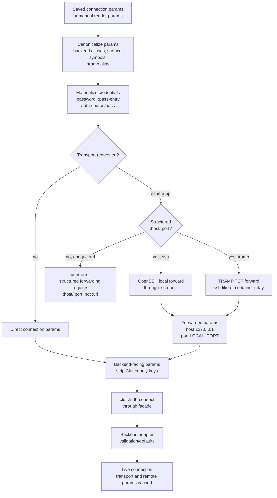
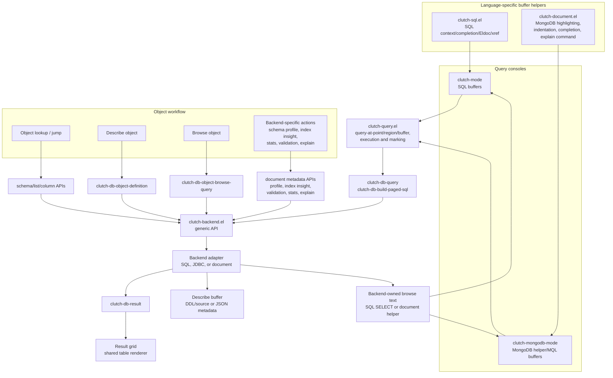
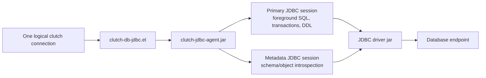

# clutch Architecture

This document is the current architecture review map for `clutch`. It describes
the module boundaries that should hold after the relational SQL, document
database, and JDBC surface refactor. Historical rationale lives in
[`postmortem/`](../postmortem/); this file should describe the current design.

## Layered Module Architecture

```mermaid
flowchart LR
  Entry["clutch.el<br/>entry point, customization,<br/>public commands, mode assembly"]

  subgraph Workflow["Workflow, UI, and query-buffer modules"]
    direction TB
    Conn["clutch-connection.el<br/>connection lifecycle, auth,<br/>SSH/TRAMP transport, transactions"]
    subgraph QueryPath["Query buffer path"]
      direction LR
      SQL["clutch-sql.el<br/>SQL context, completion,<br/>Eldoc, xref"]
      Document["clutch-document.el<br/>document query-buffer modes,<br/>MongoDB helper syntax"]
      Query["clutch-query.el<br/>query consoles, execution,<br/>statement boundaries"]
    end
    Result["clutch-result.el<br/>result, record, value,<br/>sort/filter/export commands"]
    Object["clutch-object.el<br/>object discovery, describe buffers,<br/>object actions"]
    Edit["clutch-edit.el<br/>staged edit, insert, delete,<br/>validation and commit"]
    Schema["clutch-schema.el<br/>schema refresh lifecycle,<br/>metadata caches"]
    UI["clutch-ui.el<br/>grid rendering, header/footer,<br/>navigation, JSON metadata display"]
  end

  Facade["clutch-backend.el<br/>generic database API,<br/>result struct, capability gates,<br/>shared SQL helpers"]

  subgraph Adapters["Backend adapters"]
    direction TB
    MySQL["clutch-db-mysql.el<br/>MySQL adapter"]
    PG["clutch-db-pg.el<br/>PostgreSQL adapter"]
    SQLite["clutch-db-sqlite.el<br/>SQLite adapter"]
    Mongo["clutch-mongodb.el<br/>MongoDB document adapter"]
    JDBC["clutch-db-jdbc.el<br/>JDBC adapter and sidecar client"]
  end

  subgraph External["External protocol/runtime packages"]
    direction TB
    MySQLExt["mysql.el"]
    PGExt["pg-el"]
    SQLiteExt["Emacs sqlite-*"]
    MongoExt["mongodb.el"]
    Agent["clutch-jdbc-agent.jar"]
    Drivers["JDBC driver jars"]
  end

  style Workflow fill:#f6f8fa,stroke:#6e7781,stroke-width:2px

  Entry --> Workflow
  Workflow --> Facade
  Facade --> Adapters
  Adapters --> External

  SQL --> Query
  Document --> Query
```

This diagram shows primary runtime/workflow ownership, not every `require` form.
Arrows between groups show layer boundaries; per-adapter runtime bindings are
intentionally not expanded in this overview.
The facade is the database contract boundary. Workflow modules call generic
`clutch-db-*` operations instead of protocol packages. Backend adapters own
database-specific connection params, metadata, object definitions, query
execution, and type mapping.

`clutch-query.el` is query-console workflow, not the SQL layer. SQL-specific
analysis and completion live in `clutch-sql.el` and are installed by
`clutch-mode`, whose major-mode definition remains in `clutch.el`. Document
query-buffer behavior currently lives in `clutch-document.el`; it provides
`clutch-mongodb-mode` and reuses the shared query workflow for execution.
`clutch-ui.el` is a shared rendering/helper module, not a separate workflow
entry point, so its same-layer helper edges are omitted from this overview.

## Backend And Surface Model

`mongodb` is one backend. Ordinary MongoDB uses the native document surface.
MongoDB SQL Interface is a `:surface sql-interface` path on the same backend,
with `:surface sql` accepted as a short alias.  It is not a second public
backend, driver, feature, or manual chooser entry.
DuckDB currently has a JDBC driver source and URL/runtime helpers, but no
registered backend symbol; use it through the generic `jdbc` path.

## Connection Flow

Transport is below the backend data model. SSH and TRAMP rewrite only
structured TCP endpoints. Opaque JDBC URLs and MongoDB `mongodb://` /
`mongodb+srv://` URLs are not parsed or rewritten by Clutch.
Adapter-owned validation and defaults include backend-specific checks such as
removed timeout option rejection, SSL/TLS normalization, and JDBC timeout
defaults.

## Query And Object Flow

The result grid is shared across SQL and document query results. Object
definition and browse text are backend-owned so native document backends do not
fall back to table-oriented SQL behavior.

## JDBC Runtime Shape

JDBC uses a JVM sidecar because those databases are exposed through JDBC
drivers, not through pure Elisp protocol packages. The sidecar keeps foreground
queries separate from metadata refresh where the driver/database benefits from
separate sessions.
